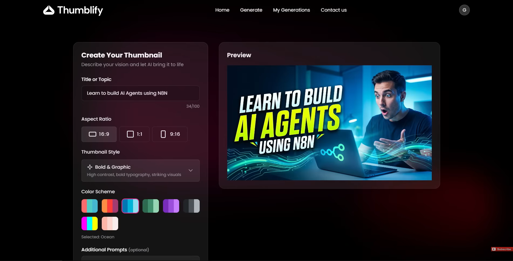
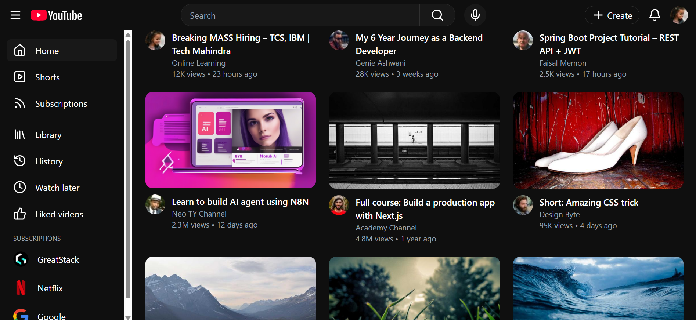
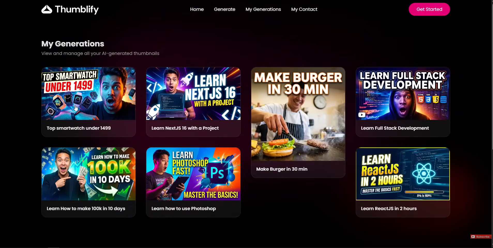

# 🎨 Thumblify – AI Thumbnail Generator

**Thumblify** is a full-stack AI-powered web application that generates YouTube-style thumbnails from text prompts.

Users can log in, describe their idea, and instantly generate thumbnails using AI. Generated images are stored in the cloud and can be accessed later from the user dashboard.

This project demonstrates a **real-world MERN architecture with AI integration**, authentication, session management, and cloud image storage.

🔗 **Live Demo (Frontend):**
https://thumblify-olive-chi.vercel.app

---

# 📌 Table of Contents

* [Project Overview](#project-overview)
* [Features](#-features)
* [Tech Stack](#-tech-stack)
* [System Architecture](#-system-architecture)
* [Screenshots](#-screenshots)
* [AI Generation Flow](#-ai-generation-flow)
* [Environment Variables](#-environment-variables)
* [Folder Structure](#-folder-structure)
* [API Endpoints](#-api-endpoints)
* [Installation & Setup](#installation--setup)
* [Future Enhancements](#-future-enhancements)
* [Author & Contact](#author--contact)

---

# Project Overview

**Thumblify** allows creators to generate professional thumbnails for YouTube videos using AI.

Users can:

* Enter prompts
* Choose styles
* Select aspect ratios
* Generate thumbnails instantly

The system stores generated thumbnails in the database and allows users to manage their generated images.

---

# 🚀 Features

### 👤 User Features

* 🔐 **User Authentication**
* 🎨 **AI Thumbnail Generation**
* ✏️ **Prompt-based image generation**
* 📐 **Aspect ratio selection**

  * 16:9 (YouTube)
  * 1:1
  * 9:16 (Shorts / Reels)
* 🎭 **Thumbnail style options**
* 🌈 **Color scheme customization**
* 🖼 **Preview generated thumbnails**
* 📂 **View generation history**
* ⬇ **Download thumbnails**

---

### ⚙️ System Features

* ☁️ **Cloudinary image storage**
* 🤖 **AI image generation using Cloudflare Workers AI**
* 🔐 **Session-based authentication**
* 🗂 **MongoDB database storage**
* ⚡ **Async thumbnail generation tracking**
* 🌐 **Production-ready CORS configuration**

---

# 🧰 Tech Stack

### Frontend

* React
* TypeScript
* Vite
* Tailwind CSS
* React Router
* Axios
* React Hot Toast

### Backend

* Node.js
* Express.js
* TypeScript
* MongoDB
* Mongoose
* Express Session
* Connect Mongo

### AI & Cloud Services

* Cloudflare Workers AI
* Cloudinary

### Deployment

* Vercel (Frontend)
* MongoDB Atlas (Database)

---

<h2><a class="anchor" id="-system-architecture"></a>🏗️ System Architecture</h2>

```
React (Frontend)
        ↓ Axios
Express API (Backend)
        ↓
MongoDB (Database)
        ↓
Cloudflare Workers AI
        ↓
Generated Image
        ↓
Cloudinary (Image Storage)
```

---

# 📸 Screenshots

### Generate Thumbnail Page


### Generated Thumbnail Preview





### My Generations Dashboard



---

# 🤖 AI Generation Flow

```
User Prompt
     ↓
Frontend sends request
     ↓
Backend API
     ↓
Cloudflare Workers AI
     ↓
Image Generated
     ↓
Upload to Cloudinary
     ↓
Save metadata in MongoDB
     ↓
Return image URL to user
```

---

# 🔑 Environment Variables

### Backend (.env)

```
MONGODB_URI=
SESSION_SECRET=

CLOUDFLARE_ACCOUNT_ID=
CLOUDFLARE_API_TOKEN=

CLOUDINARY_CLOUD_NAME=
CLOUDINARY_API_KEY=
CLOUDINARY_API_SECRET=
```

---

# 📦 Folder Structure

```
Thumblify
│
├── client/                 # React Frontend
│   ├── src/
│   │   ├── components/
│   │   ├── context/
│   │   ├── configs/
│   │   ├── pages/
│   │   └── App.tsx
│
└── server/                 # Express Backend
    ├── configs/
    ├── controllers/
    ├── middleware/
    ├── models/
    ├── routes/
    ├── services/
    │   └── providers/
    └── server.ts
```

---

# 🧪 API Endpoints

### Auth

| Method | Endpoint           | Description   |
| ------ | ------------------ | ------------- |
| POST   | /api/auth/register | Register user |
| POST   | /api/auth/login    | Login user    |
| GET    | /api/auth/logout   | Logout user   |

---

### Thumbnail

| Method | Endpoint                | Description           |
| ------ | ----------------------- | --------------------- |
| POST   | /api/thumbnail/generate | Generate AI thumbnail |
| GET    | /api/thumbnail/my       | Get user thumbnails   |
| DELETE | /api/thumbnail/:id      | Delete thumbnail      |

---

### User

| Method | Endpoint          | Description      |
| ------ | ----------------- | ---------------- |
| GET    | /api/user/profile | Get user profile |


---

# 🛠️ Installation & Setup <a id="installation--setup"></a>

### Clone repository

```
git clone https://github.com/abhijitradhakrishnan/Thumblify.git
```

```
cd Thumblify
```

---

### Install dependencies

Frontend

```
cd client
npm install
```

Backend

```
cd ../server
npm install
```

---

### Run the project

Backend

```
npm run dev
```

Frontend

```
cd client
npm run dev
```

---

# 🚀 Future Enhancements

### AI Improvements

* More thumbnail styles
* Prompt suggestions
* AI text overlays

### Product Features

* User credit system
* Thumbnail templates
* Public gallery
* Image editing tools

### Performance

* Background generation queue
* Redis caching
* Rate limiting

---

<h2><a class="anchor" id="author--contact"></a>👨‍💻 Author & Contact</h2>

**Abhijit Peringadan**

MERN Stack Developer

📧 Email: peringadanabhijit@gmail.com  
🔗 [LinkedIn](https://www.linkedin.com/in/abhijit-radhakrishnan/)  
🔗 [Portfolio](https://abhijit-portfolio-eight.vercel.app/)

---
